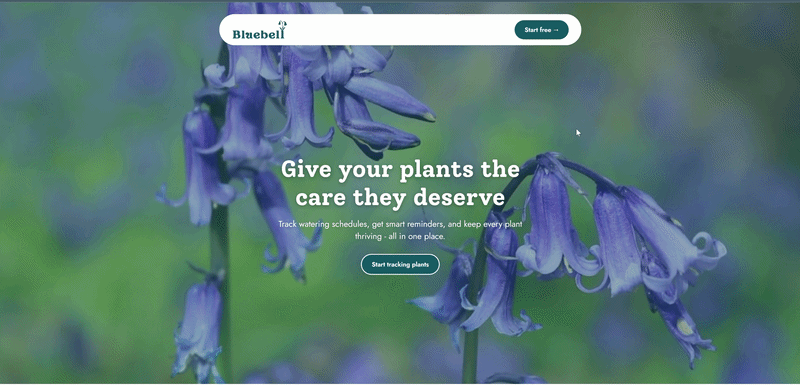

  

# Keep Your Plants Alive

A plant watering/care tracker. Users add, edit, water, and remove
plants with no account at all; signing in with Google is only needed if you
want SMS/email reminders. Flask + SQLite backend, plain HTML/CSS/JS frontend.

## Features

- Add plants with a name, species, watering frequency, sunlight needs, and
  notes; edit or remove them inline; mark them watered with one click.
- The report view flags any plant that's currently overdue for watering and
  shows its exact next-due date.
- Optional daily or when needed reminder digests by SMS and/or email, opt-in per signed-in
  Google account, for plants that are overdue.
- Bluebell-branded landing page with a video hero above the tracker.

## Demo

